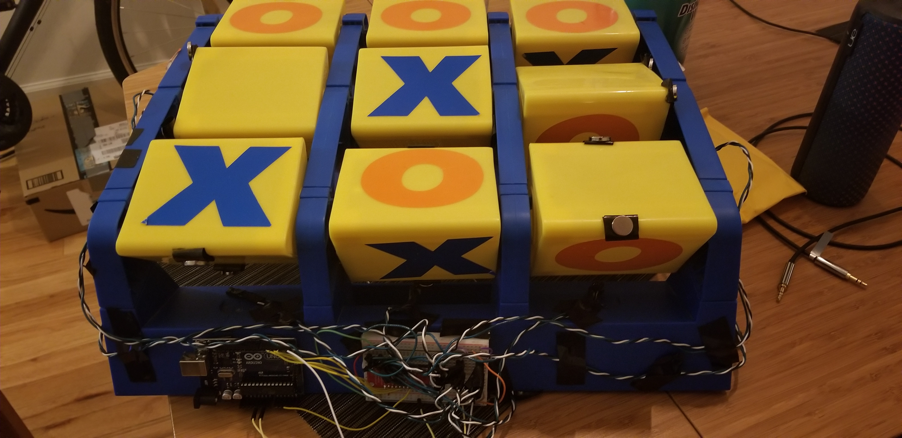
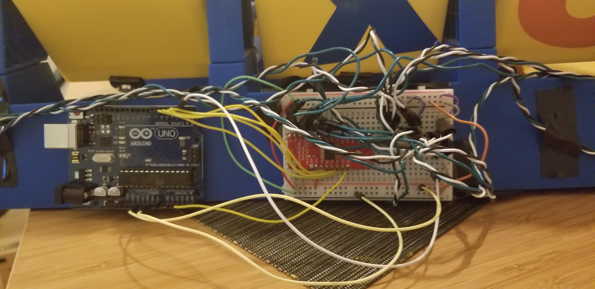
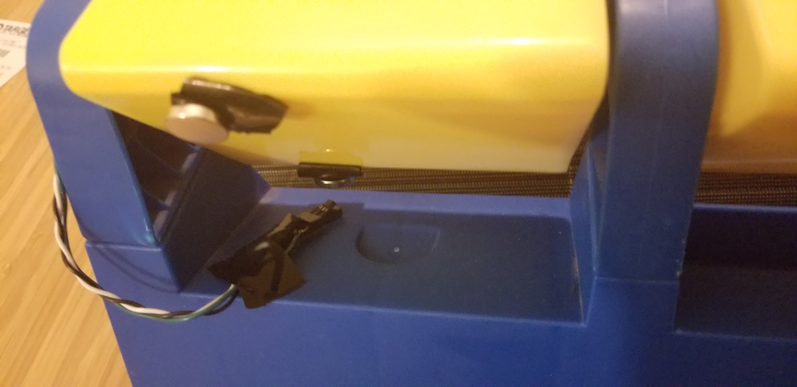

# General Overview
Using Hall Effect sensors with magnets taped onto a physical tic tac toe board, this project aims to produce comparative human and robotic tones and voice lines based on the state of the tic tac toe game being played. X's are considered the "robot" side, while the O's are the human. The project fundamentally acts as a sort of augmentation to the physical board itself, adding audio queues to the game.

# User Experience
## Intended User
This instrument is intended likely for a older child/teenager interested in playing tic tac toe (as I'd imagine that's generally the audience that would play tic tac toe in the first place). I would say it would be for young children as well, however, some of the voice lines included involves a bit of swearing (oopsies).

## Intended Use Case
This would be best for two people wanting to play tic tac toe in an environment with few others around, as due to the fact that this instrument makes noise, it wouldn't be optimal in a public location. Maybe a house or a person's room would work.

## Instructions on How to Play
Assuming the software is set up, the game plays normally as the original physical board was intended - you flip a block over to either X or O, depending on which player you are, and you aim to obtain a row of three of your shape in a row/column/diagonal. The only caveat is that in order to reset the board state once a game is finished, one must press A on the keyboard, followed by S, as these two buttons are used to reset the software state and volume levels of the game. Additionally, the blocks must be flipped to the blank state upwards, although that was innately involved in the game process regardless.

# Hardware
## Components Used
- Arduino + breadboard
- 9 Hall Effect Sensors
- Mux chip
- 18 magnets
- Tic Tac Toe board (purchased at Goodwill for $4)

## Component Arrangement
With an arduino and breadboard mounted on the side of the tic tac toe board, these two components hold the chip components of the instrument together. A mux chip is required on the breadboard, as due to the fact that nine hall effect sensors are needed for each block, and that there are only six analog pins on the arduino, the mux allows for more analog outputs that the instrument needs. These nine hall effect sensors are then placed in various places on the board that allow for them to be in close proximity to the blocks in some shape or form. Pictures of where they were generally placed are shown below. Finally, magnets are taped onto the board, two on each block, in such a fashion that one is faced to have a positive polarization when an O is face up, and a negative polarization when an X is face up (the goal of this being differentiating which block is face up to the software). 

# Software
## Arduino Code
The arduino code may be viewed in the repo in the mux folder. The purpose of this code is to read the hall effect sensor readings and have them be readable by Max, using methods taught by Michael Gurevich. Michael's resources may be found [here.](https://umich.app.box.com/v/Physcomp)

## Max Code
The Max code is the brunt of the work of this project. It may be viewed as the "Final final.maxpat." The components are split below to generally explain the flow and features of the program.

### Arduino Code Reading
First, the code takes in readings from the Arduino, reading from serial port h on my machine. Using the methods taught by Professor Gurevich, based on the pin being read at any one moment (having nine total of these pins for each sensor), they're given a value to select from, in which the list of the ensuing values is grouped, unpacked, and bit shifted in order to obtain values above 128. These readings should innately be around 517, as this is approximately the neutral value of the sensors. 

### Determining and Setting Which Player Moved
Following, based on the value of the sensor reading is above 550 or below 490 (to signify positive or negative), the program feeds this value to everything else, locking the value sent through the use of a gate function (ultimately locking the game state of that block for the rest of the game as a precaution against the blocks potentially moving and latering the value, since the sensors are quite sensitive). 

It's at this point that the code splits into two separate boards (as marked by the sets of the two 3x3 sets of triggers). This is due to the fact that at the time of creating this project, I am not aware if there is an object that can hold a neutral, positive, and negative state. As such, instead, I used two separate boards, one for the X player, one for the O player. The results of the code mentioned so far will result in these 3x3 boards, visualizing which spot was picked. Again, due to the gate function, if a block is flipped, the block on the opposite board corresponding to the same spot may not be set).

Determining and individualizing each block is done through some math, following the concept of binary, in which each block corresponds to a value represented by 2^x power. This allows for the ability to specify and list each block individually and uniquely identify each one, ultimately allowing for further math to be computed based on these values.

### Win State
Win states are determined by obtaining an image of the board through the use of a pak. With this board, due to the math mentioned in the prior section, we can compare the list of these values to separate lists that are arranged to be those of what would be considered the winning states (horizontal, vertical, and diagonal lines) based on the blocks' corresponding values. Then, using zl sect and zl sum, if the game state conatins the arrangements of those comparative lists, then we say that a game is won. This result is then gated (to prevent other win states from occurring) and sent to later portions of the code.

### Turn Detector
As a sort of extra feature, a turn detector was implemented to allow for voice lines to communicate throughout the game to add some personality to the project. This is detected through a counter that moves each time a turn is decided. Then, this counter is grouped with the value of the corresponding block that was altered, only adjusting and communicating a voice line when both the counter is changed and when the block changed corresponds to the side that's turn it is. 

### Voice Lines
Due to the fact that there are nine blocks, nine total turns in a game of tic tac toe, and two players, we have the option for up to 162 unique voice lines. With this, while I wasn't able to make that many, I decided to make a few based on what I would imagine are popular (and unpopular) moves on certain turns. For example, if the middle block is chose on the first turn, a voice line says "Oh, the middle block first, a classic." Such was made for each block for turns 1, 2, 8, and 9 (1 and 2 for the same line, since whether X or O goes first can change) (8 and 9 to signify when a draw was likely to happen). For every other turn for every block except the 5 block, the voice line chosen was random, determined by an urn of 4 varying voice lines. For the 5 block, different lines were chosen based on the turn to joke about how early it's usually chosen. For all of these voicelines, there were two copies played throughout the game - one in a robotic voice (generated by the following [website](https://lingojam.com/RobotVoiceGenerator)) and the other by recording my roommate, Shaleahk Wilson, saying various scripted lines. As such, overall, we're able to sort of add commentary to the game, creating a rivalry between my roommate and this robot voice that goes along with the state of the game. All sounds may be found in the Sounds folder (instructions for how to add these sounds properly may be found at the bottom of the Max patch (god bless Philip for that code, been with me through thick and thin).

### Block Audio
Finally, to make this more instrumental, each block, when pressed, sounds a different tone. With a robotic sound as one player and a woman singing as the other player, this was aimed to have a sort of "Human vs. Robot" aspect to itsself, waging an all powerful, all important, everything's on the line game of tic tac toe. This can be demonstrated and exemplified in the silly voice lines added that play on each turn. Ultimately, I wished to create noticeably different sounds on each turn that sounded good together. The robotic sound was created by taking a couple of sound bits from the song Goodbye To A World by Porter Robinson and pitch shifting them in Adobe Audition. The woman acapella singing was obtained from the following [sound file](https://freesound.org/people/mooncubedesign/sounds/442571/) on Freesound.org and pitch shifted to match the robot sounds. Credits to helping out what sounds to pitch to goes to Karen Bao.

# Demo + Resources
If not at the top of the page, the link to the repo containing all files may be found [here.](https://github.com/JustinFC/EECS-397-DMID-Tic-Tac-Toe-Final-Project)
A video demo may be found [here.](youtube.com)

# Lessons Learned
Creativity is hard. Throughout working on this project, knowing that I'd somehow manipulate this tic tac toe board, I went through the motions of creating the hardware and the logic for the game of tic tac toe itself, nervously hoping in the back of my mind that I'd just strike gold with how I'd ultimately manipulate sound into the instrument to make it special. However, coming down to the final days, it was hard to come up with anything. I was fortunate enough to chug through the logic portions needed to make it run, approaching each problem a subproblem at a time. However, I became consumed with these tasks and held off on thinking about what this would actually do in the end. It took until the day of the presentation where I woke up, having added the voice lines but not the block audio, to think to myself "Oh my god, I just made tic tac toe in an instrument-making class." Having to think of something to really give the instrument flavor and personality is tough work and requires passion and the effort to really want to have a vision for the work I'm creating. I'm hoping that in future projects that require such similar creative thought processes that these thoughts can guide me before the logic does (or, I should at least have a good balance between the two). The logic guided me up until the last day where I realized I needed to implement other actually creative portions that required attention and moderate alterations to prior-made components, setting me back and making the last day of making this projet a lot more stressful than it needed to be, and that's definitely not the way to go about such projects. This project, ultimately though, was a fun and engaging way to learn this valuable lesson.

# Future Improvements
### Improved Board Quality
Currently, while functional, the instrument is quite fragile, ensuring that no one tampers with it or shakes it around too much due to the fact that everything is taped on. Creating a sort of apparatus to hold everything and improving the quality of my wiring work would do wonders.

### Determining Full Board State
While I can determine which block is played on each turn, I'm unable to determine the state of the overall board and how the most recent move affected that board. If so, this would allow for smarter statements to be made, such as statements regarding blocking the other player's recent move.

### Cleaner Code 
Honestly, while the top half of the code is moderately clean and more understandable, the bottom half was written over a weekend during late nights right before the due date. As such, a lot of it is incredibly messy and there's no documentation to support any of it. Taking the time to go back through everything would help allow this instrument to be sustained.

